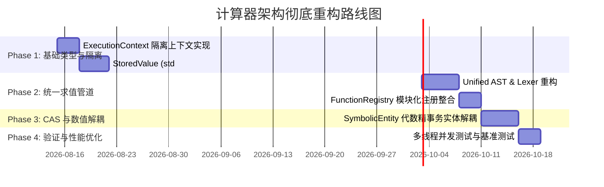

# 计算器系统架构彻底重构方案 (Architecture Refactoring Plan)

## 1. 概述与背景 (Overview & Background)

在之前的代码重构与分析中，虽然矩阵计算的核心数值缺陷已得到了全面修复，并且模块层级的向上依赖（如 `app/scalar_type.h`）得到了初步解耦，但整个计算器系统在**全局状态隔离、求值管道冗余、类型系统安全性、CAS 符号与数值引擎耦合、以及依赖注入模式**方面依然存在严重的深层次架构隐患。

本方案旨在提供一个**高内聚、低耦合、线程安全、支持多实例并发（Multi-tenancy）与类型安全**的全新系统架构设计，彻底解决当前代码库中的架构瓶颈。

---

## 2. 核心架构缺陷诊断 (Diagnostic Matrix)

| 序号 | 架构领域 | 现存核心问题 | 架构隐患与影响 |
| :-: | :--- | :--- | :--- |
| **1** | **全局状态与并发** | 存在 5 个独立的全局 `static` 精度单例（如 `set_process_display_precision`） | 无法支持多 `Calculator` 实例隔离，多线程并发运算时产生数据竞态与计算失真 |
| **2** | **求值管道** | 存在 4 套平行的 Parsing / Dispatch 通道（Unified, Command, Script, CAS） | 语法规则与优先级冲突，新增数学函数需要在 4 个注册表中重复复制代码 |
| **3** | **类型系统** | `StoredValue` 采用 16 字段 C 风格结构体 + 8 个 `bool` 手工标记 | 内存冗余大，缺乏 `std::variant` 的类型安全，依赖人工标志位易导致空指针崩溃 |
| **4** | **CAS / 数值耦合** | 符号表达式引擎 (`SymbolicExpression`) 隐式依赖浮点近似与全局 App 精度 | 符号推导被浮点数污染（产生 `1.0000000001*x`），破坏精精确代数推导语义 |
| **5** | **服务依赖** | 使用 `ServiceLocator` 动态解析 `CoreServices` | 隐藏依赖关系，无法在编译期检查依赖补全，服务缺失时引发运行时崩溃 |

---

## 3. 目标架构设计 (Target Architecture)

重构后的系统架构遵循**严格单向分层（Layered Architecture）与领域驱动（Domain-Driven）**原则：

```
┌─────────────────────────────────────────────────────────────┐
│                      1. Client / App Layer                  │
│                main.cpp, CLI Interface, REPL                │
└──────────────────────────────┬──────────────────────────────┘
                               │
┌──────────────────────────────▼──────────────────────────────┐
│                    2. Calculator Engine API                 │
│                 Calculator, CalculatorInstance              │
└──────────────────────────────┬──────────────────────────────┘
                               │
┌──────────────────────────────▼──────────────────────────────┐
│                  3. Execution & Pipeline Layer              │
│       UnifiedLexer ──► UnifiedParser ──► ASTEvaluator       │
│                            │                                │
│                            ▼                                │
│                     ExecutionContext                        │
│             (Scope, Config, FunctionRegistry)               │
└──────┬───────────────────────┬───────────────────────┬──────┘
       │                       │                       │
┌──────▼──────┐         ┌──────▼──────┐         ┌──────▼──────┐
│ Matrix      │         │ Symbolic    │         │ DSP &       │
│ Domain      │         │ CAS Domain  │         │ Analysis    │
└──────┬──────┘         └──────┬──────┘         └──────┬──────┘
       │                       │                       │
┌──────┴───────────────────────┴───────────────────────┴──────┐
│                    4. Core Type System                      │
│        StoredValue (std::variant), Scalar (Type Layer)      │
└──────────────────────────────┬──────────────────────────────┘
                               │
┌──────────────────────────────▼──────────────────────────────┐
│                   5. Low-Level Math Base                    │
│            PreciseDecimal, Float128, Rational               │
└─────────────────────────────────────────────────────────────┘
```

---

## 4. 关键子系统重构方案 (Detailed Subsystem Designs)

### 4.1 实例上下文隔离与线程安全 (`ExecutionContext`)

**目标**：消除所有全局 `static` 单例，将显示精度、计算精度、模式配置及变量作用域完全收拢并绑定到当前 `ExecutionContext` 实例中。

```cpp
namespace core {

struct ExecutionConfig {
    int display_precision = 10;
    int internal_precision_scale = 50;
    bool exact_mode = false;
    bool symbolic_constants_mode = false;
    bool hex_uppercase_mode = false;
};

class ExecutionContext {
public:
    ExecutionContext();

    // 实例级配置管理
    ExecutionConfig& config() { return config_; }
    const ExecutionConfig& config() const { return config_; }

    // 实例级作用域与符号/函数注册表
    Scope& scope() { return scope_; }
    FunctionRegistry& functions() { return function_registry_; }

    // 线程安全的局部上下文切换
    class ScopeGuard {
    public:
        ScopeGuard(ExecutionContext& ctx);
        ~ScopeGuard();
    };

private:
    ExecutionConfig config_;
    Scope scope_;
    FunctionRegistry function_registry_;
};

} // namespace core
```

---

### 4.2 基于 `std::variant` 的现代类型系统 (`StoredValue`)

**目标**：替代 16 字段的手工 C 风格结构体，采用类型安全、高效且自描述的 Modern C++ 变体类型。

```cpp
namespace types {

using ListValue = std::vector<StoredValue>;
using DictValue = std::map<std::string, StoredValue>;

using ValueVariant = std::variant<
    std::monostate,                  // 空值 (Nil/None)
    Scalar,                          // 标量 (PreciseDecimal / float128_t)
    Rational,                        // 精确有理数
    mymath::complex<Scalar>,         // 复数
    std::string,                     // 字符串
    matrix::Matrix,                  // 矩阵
    std::shared_ptr<ListValue>,      // 脚本列表
    std::shared_ptr<DictValue>       // 脚本字典
>;

class StoredValue {
public:
    StoredValue() : data_(std::monostate{}) {}
    StoredValue(Scalar s) : data_(s) {}
    StoredValue(Rational r) : data_(r) {}
    StoredValue(matrix::Matrix m) : data_(std::move(m)) {}
    StoredValue(std::string str) : data_(std::move(str)) {}

    // 类型查询 API
    bool is_scalar() const { return std::holds_alternative<Scalar>(data_); }
    bool is_matrix() const { return std::holds_alternative<matrix::Matrix>(data_); }
    bool is_complex() const { return std::holds_alternative<mymath::complex<Scalar>>(data_); }

    // 类型安全访问 API (基于 std::get / std::get_if)
    const Scalar& as_scalar() const { return std::get<Scalar>(data_); }
    const matrix::Matrix& as_matrix() const { return std::get<matrix::Matrix>(data_); }

    // 模式元数据
    bool is_exact() const { return is_exact_; }
    void set_exact(bool exact) { is_exact_ = exact; }

    // 通用 Visitor 支持
    template <typename Visitor>
    decltype(auto) visit(Visitor&& visitor) const {
        return std::visit(std::forward<Visitor>(visitor), data_);
    }

private:
    ValueVariant data_;
    bool is_exact_ = false;
    std::string symbolic_source_expr_; // 延时符号化源文本
};

} // namespace types
```

---

### 4.3 统一求值管道 (Unified AST & Pipeline)

**目标**：收拢现有的 4 套 Parsing 通道，建立统一的语法树 (AST) 与求值调度管道。

```
输入文本 ──► UnifiedLexer ──► UnifiedASTParser ──► UnifiedAST ──► ASTEvaluator ──► StoredValue
                                                      │
                                                      ├── ScalarNode
                                                      ├── BinaryOpNode
                                                      ├── FunctionCallNode
                                                      └── MatrixLiteralNode
```

1. **统一语法树节点设计 (`ASTNode`)**：
   所有语法结构（数值、矩阵字面量、函数调用、变量引用、控制流）统一构建为 `ASTNode` 层次结构。
2. **函数注册中心 (`FunctionRegistry`)**：
   统一管理所有内置函数、矩阵函数与 DSP 函数的注册，消除多次重复注册：
   ```cpp
   using NativeFunction = std::function<StoredValue(
       const std::vector<StoredValue>& args,
       ExecutionContext& ctx)>;
   ```

---

### 4.4 符号计算 (CAS) 与数值引擎彻底解耦

**目标**：建立明确的代数精确推导与数值近似推导的隔离墙。

1. **符号表示层独立 (`SymbolicEntity`)**：
   符号表达式内部使用精确实体（有理数系数 + 符号变量），禁用任何隐式浮点数转换。
2. **显式数值化转换器 (`SymbolicEvaluator`)**：
   符号化简、求导、积分过程完全保持精确代数形式；只有当用户显式调用 `evalf()` 或 `N()` 时，才通过 `SymbolicEvaluator` 传入 `ExecutionContext` 将符号表达式求值为数值 `StoredValue`。

---

## 5. 迁移路线图与实施步骤 (Implementation Roadmap)



### 阶段 1：基础类型与实例上下文隔离 (Phase 1)
1. 创建 `src/core/execution_context.h`，实现 `ExecutionContext` 与 `ExecutionConfig`。
2. 重构 `src/types/stored_value.h`，使用 `std::variant` 替换 C 风格结构体与标记位，更新全工程访问点。
3. 清除 process-wide 全局 `static` 精度单例，将其收拢至 `ExecutionContext`。

### 阶段 2：统一 Parsing 与 AST 求值管道 (Phase 2)
1. 整合 `UnifiedExpressionParser` 与 `ScriptParser`，建立统一的 `UnifiedAST`。
2. 构建 `FunctionRegistry`，将 `MatrixModule`、`StatisticsModule`、`DspModule` 统一注册至 `ExecutionContext`。
3. 弃用 `ServiceLocator` 动态解析，改用 `ExecutionContext` 显式传递。

### 阶段 3：CAS 符号引擎解耦 (Phase 3)
1. 重构 `SymbolicExpression`，将数值求值逻辑拆分至 `SymbolicEvaluator`。
2. 确保符号推导过程中的有理数与整数运算完全不经过 `float128_t` / 双精度浮点转换。

### 阶段 4：并发验证与性能测试 (Phase 4)
1. 编写多线程测试用例，验证多个 `Calculator` 实例在不同线程、不同精度配置下并发执行的隔离性与结果准确性。
2. 运行完整单元测试集与性能 Benchmark，确保无回归问题。

---

## 6. 验证与验收标准 (Verification & Acceptance Criteria)

1. **实例隔离验证**：创建 10 个 `Calculator` 实例，分别设置不同的显示精度与精确模式，多线程并发执行运算，验证结果互不干扰。
2. **类型安全验证**：零未定义行为与零非法指针解引用，基于 `std::holds_alternative` 与 `std::visit` 保证编译期类型安全。
3. **注册一致性验证**：新增任意数学函数只需在 `FunctionRegistry` 声明一次，所有求值管道（交互式 REPL、脚本、矩阵表达式）自动同步生效。
4. **单元测试通过率**：测试集 100% Passed，且无编译警告。
